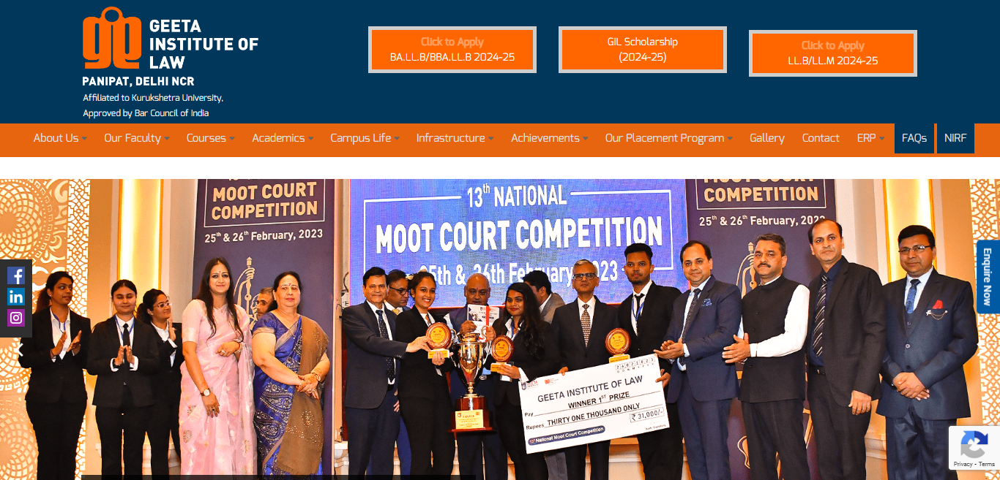
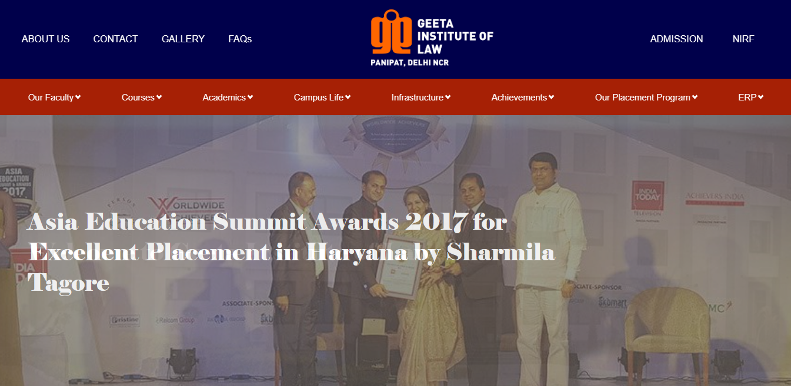

# Geeta Law College [Revamp]

## About

This is a project to revamp the website of [Geeta Law College](https://geetalawcollege.in), Panipat. The website is built using basic HTML, CSS and JavaScript. The website can be accessed [here](https://law.geetalawcollege.in/).

> Make Sure to ⭐ the Repo if You liked it -- It Helps!

## Why this project?

The existing website of Geeta Law College is not responsive and is not user friendly. The website is not updated regularly and is not maintained properly. The loading speed of the website is very slow. 

Therefore, this project is aimed at revamping the website of Geeta Law College to make it responsive, user friendly and to improve the loading speed of the website.

## Comparison

### Existing Website

### Revamped Website

## Features

- [x] Responsive
- [x] User Friendly
- [x] Fast Loading Speed
- [x] Easy Navigation
- [ ] Easy to Maintain
- [ ] Backend System
- [ ] Deployment on Official Website

## How to contribute?

1. Fork this repository.
2. Clone the repository to your local machine.
3. Create a new branch.
4. Make the changes.
5. Commit and push the changes to your forked repository.
6. Create a pull request.

## How to run the website locally?

1. Clone the repository to your local machine.
2. Install [XAMPP](https://www.apachefriends.org/index.html).
3. Open XAMPP and start Apache server.
4. Copy the `content` folder from cloned repository to the `htdocs` folder in the XAMPP installation directory [You should rename the content folder as per your needs as well].
5. Open your browser and go to `localhost/Geeta-Law-College-Revamp` (or the name of the folder which you copied in the step earlier).
6. The website will be running locally on your machine.

## Contributors

- [Kaushik Goswami](https://github.com/thekaushikgoswami)
- [Humanshu Jaglan](https://github.com/humanshu001)
- [Ankur Jaglan](https://github.com/AnkurJaglan07)
- [Aditi Sahoo](https://github.com/aditisahoo12)
- [Khushi Rana](https://github.com/khushirana001)
- [Priyanshi Raj](https://github.com/Priya620014)
- [Shubhdeep](https://github.com/Shubh-0213)
- [Lovepreet Kaur](https://github.com/Lovepreet-Kaur-Gill)
- [Diya Gupta](https://github.com/diyagupta001)

> All the contributors are listed randomly and not in any particular order.

## License

This project is licensed under the MIT License - see the [LICENSE](LICENSE.md) file for details.

Made with ❤ in India